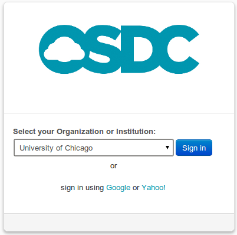
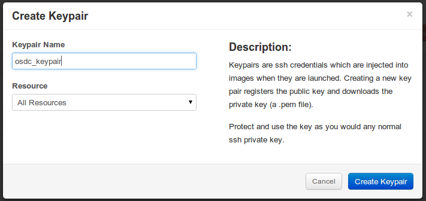

Using The OSDC Console
=============================
Once you have an `OSDC account  <https://www.opensciencedatacloud.org/apply/>`_ you can manage your cloud resources through the `OSDC Console <https://www.opensciencedatacloud.org/consle/>`_ .

Login
-----
Users authenticate to the OSDC console using Single Sign-On.  We recommend users login using credentials from an institution or organization that is part of `The InCommon Federation <https://incommon.org/federation/>`_.  If you are not affiliated with a `participating organization <https://incommon.org/federation/info/all-entities.html>`_ you can use a gmail or yahoo account.

Example
^^^^^^^
* Select the organization of the "Login E-mail" from your application.  If my Login E-mail is mgreenway@uchicago.edu I would select "University of Chicago".

    Select Your Identity Provider

* Click "Sign in".  The console will redirect to your institution's login page.

* Once you authenticate your institution will redirect you back to the OSDC Console.

Managing SSH Keys
-----------------
Users access OSDC login nodes and virtual machines through SSH using keypair authentication.  Before launching a virtual machine you must import a public key or create a new keypair.  To mange your keypairs go to `Access & Security <https://www.opensciencedatacloud.org/project/access_and_security/>`_.

Creating Keypairs
~~~~~~~~~~~~~~~~~
To create a keypair click "Create Keypair" name the keypair then select the resource.  Click "Create Keypair" then Download keypair on the download page.

Example:
^^^^^^^^
* Click "Create Keypair"
* In "Keypair Name" enter "osdc_keypair"
* Under "Resources" select "All Resources"
* Click "Create Keypair"

    Enter the Keypair Details

* Launch and instance and select the keypair "osdc_keypair".
* If you are using OpenSSH (see :doc:`/ssh` for other SSH clients) ``ssh-add osdc_keypair.pem``
* ``ssh -A -i osdc_keypair.pem login2.opensciencedatacloud.org`` to access the login node.
* SSH to your vm ``ssh ubuntu@INSTANCE_IP``.  If you are not launching instances on the Sullivan cloud replace login2.opensciencedatacloud.org with the hostname of that cloud and replace ubuntu as shown in :doc:`/quickstart`

Importing Keys
~~~~~~~~~~~~~~
To import a public key click "Import Keypair".  Enter a name for the keypair then paste the OpenSSH format text of the public key into the Public Key field.  The public key text must all be on one line.  Then select the resource you will use this keypair to access.

Differences Between Protected Clouds and Public Clouds
~~~~~~~~~~~~~~~~~~~~~~~~~~~~~~~~~~~~~~~~~~~~~~~~~~~~~~
On public clouds such as Adler and Sullivan you must have a keypair for your virtual machine instances.  On protected clouds your home directory is shared between the login nodes and the virtual machines.  On both public and protect clouds you will need a keypair for the login server.  On protected clouds you can use this same keypair to access VMs using SSH key forwarding.

Video Tutorials
--------------

Using the OSDC - Logging in for the First Time
^^^^^^^^^^^^^^^^^^^^^^^^^^^^^^^^^^^^^^^^^^^^^^

.. raw:: html

        
<object width="480" height="385"><param name="movie"
        value="http://www.youtube.com/v/QXo89lttfUM&hl=en_US&fs=1&rel=0"></param><param
        name="allowFullScreen" value="true"></param><param
        name="allowscriptaccess" value="always"></param><embed
        src="http://www.youtube.com/v/QXo89lttfUM&hl=en_US&fs=1&rel=0"
        type="application/x-shockwave-flash" allowscriptaccess="always"
        allowfullscreen="true" width="480"
        height="385"></embed></object>

Using the OSDC - Launching and Instance
^^^^^^^^^^^^^^^^^^^^^^^^^^^^^^^^^^^^^^^
.. raw:: html

        
<object width="480" height="385"><param name="movie"
        value="http://www.youtube.com/v/2aPMOhCgIHw&hl=en_US&fs=1&rel=0"></param><param
        name="allowFullScreen" value="true"></param><param
        name="allowscriptaccess" value="always"></param><embed
        src="http://www.youtube.com/v/2aPMOhCgIHw&hl=en_US&fs=1&rel=0"
        type="application/x-shockwave-flash" allowscriptaccess="always"
        allowfullscreen="true" width="480"
        height="385"></embed></object>

