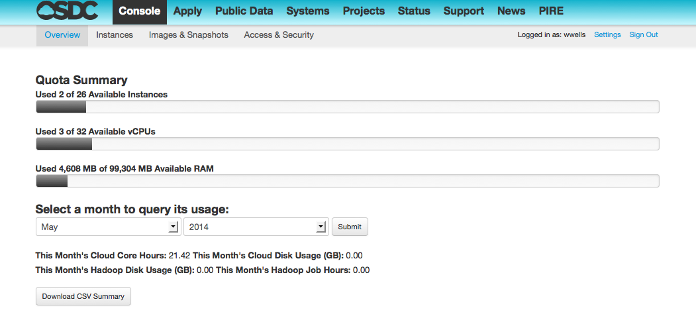

Tukey - The OSDC Console
=========================

What is Tukey?
-------------------------

Tukey is the OSDC webconsole used to login, authenticate, manage VMs, review resource use and much, much more.  
Tukey was developed because nothing existed with all the features we needed for a 
portal to the OSDC.  There are offerings like Elasticfox and Horizon which 
lacked features such as federated authentication using Shibboleth, SSH keypair generation 
for gateway machines, and support for multiple types of clouds.

.. sidebar::  Who was John Tukey?

	The Tukey console is named after John Tukey, an American mathematician best known
	for the development of the FFT algorithm and the box plot. 

Tukey is written in Python using the Django framework and Horizon, the OpenStack dashboard.  
The Tukey Portal project provides a web front end for tools used and developed for managing 
OSDC resources and the Tukey Middleware project provides a translation layer between cloud resource, 
primarily EC2, and the OpenStack API.

Lead developer Matt Greenway says:

    “The idea to leverage Horizon came from an `OSDC PIRE  <http://pire.opensciencedatacloud.org/>`_ workshop in Edinburgh. Horizon is a nice 
    interface that a lot of work has gone into and we want Tukey to be able to use all of Horizon's 
    new features while adding features to Tukey that are unrelated to OpenStack.”

Tukey is open-source and freely available on Github and is licensed under the
Apache License, Version 2.0.  

*	`Tukey Middleware  <https://github.com/LabAdvComp/tukey_middleware>`_ 
*	`Tukey Portal  <https://github.com/LabAdvComp/tukey_portal>`_ 

In brief, Tukey is a user-friendly webconsole interface that allows OSDC users to:

*   :ref:`Securely login and gain authenticated access <login>`
*	:ref:`Manage keypairs <managekeypair>`
*	:ref:`Select, launch, and terminate VMs and clusters <launch>`
*	:ref:`Review the status of launched VMs <inst_status>`
*	:ref:`Snapshot VMs <snapshot>`
* 	:ref:`View Core and Storage use <metering>`

.. _metering:

Metering and Quotas
-------------------------

To help distribute limited resources among many different research projects, we set quotas
on core hours and storage, allow users to view current use vs quota in the Overview tab of the Tukey console, 
and send monthly metering statements to individual users and PIs and administrators of larger projects.   
We have found this to be a helpful way for individuals and labs to see the magnitude of resources they're using. 
This promotes good social behavior like freeing up valuable resources for other projects by terminating 
VMs that are not in use or periodically cleaning out storage. 

.. sidebar::   What is a Core Hour?

	A Core Hour is defined as each hour a core is spun up and used by a user VM.  The number of cores used
	by the VM depends on the :ref:`Flavor  <flavors>` selected when launched. 
	
Monthly metering statements are sent via email, and in addition to having details about the number of 
core hours and GB of storage used during a given period, they also have a corresponding dollar value.   We currently
use pricing competitive with AWS EC2 and S3 rates.  Seeing a dollar figure helps OSDC users
better understand the value provided by an OSDC resource allocation.   

Currently, there are no actual chargebacks during the OSDC Beta phase.   In order to make the OSDC a sustainable
project, we will eventually begin to reduce the number of credits available to OSDC users.   

Our goals are: 1) make OSDC resources available for free to users with low usage requirements; 
2) make OSDC resources available to small to medium size scientific projects at a break even cost 
by helping these projects obtain funding and subsidizing these projects with funds and grants 
that we are able to obtain; and 3) pass on to other categories of users our actual costs 
so that OSDC facilities and resources can be sustainable.  We assume that large 
scientific projects (a fourth category of potential users) will build their own infrastructure 
or use commercial offerings and will not be using OSDC resources.

Quotas are set at the time an account is created.  If you need a larger quota for a particular
research project, send an email to accounts@opencloudconsortium.org with the start and end
dates for the requested upgrade, what you need upgraded, and the reason for the need.

..  topic::  Quota upgrade request example

	I need 32 cores and 5TB of storage for one month starting on Jan 1st to help meet
	a publication deadline for my research on ________.   I will be using these additional 
	cores and storage to ______________.

    Sample Quota / Resource Screen

.. _login:

Login and Authentication
-------------------------
Once you have an `OSDC account  <https://www.opensciencedatacloud.org/apply/>`_ you 
can manage your cloud resources through the `OSDC Console <https://www.opensciencedatacloud.org/console/>`_ .

Users authenticate to the OSDC console using Single Sign-On.  We recommend users 
login using credentials from an institution or organization that is part of 
`InCommons  <https://incommon.org/federation/info/all-orgs.html>`_, the 
`UK Federation  <http://www.ukfederation.org.uk/content/Documents/MemberList>`_, 
or `CANARIE  <http://www.canarie.ca/en/about/partners/members>`_.

EXAMPLE:  Logging into the Tukey Console
^^^^^^^^^^^^^^^^^^^^^^^^^^^^^^^^^^^^^^^^
* Select the organization of the "Login E-mail" from your application.  If your Login 
  E-mail is janedoe at uchicago.edu you would select "University of Chicago".

.. figure:: _static/login.png
    :alt: Single Sign-On Identity Provider Selection
    :align: center

    Select Your Identity Provider

* Click "Sign in".  The console will redirect to your institution's login page.
* Once you authenticate your institution will redirect you back to the OSDC Console.
