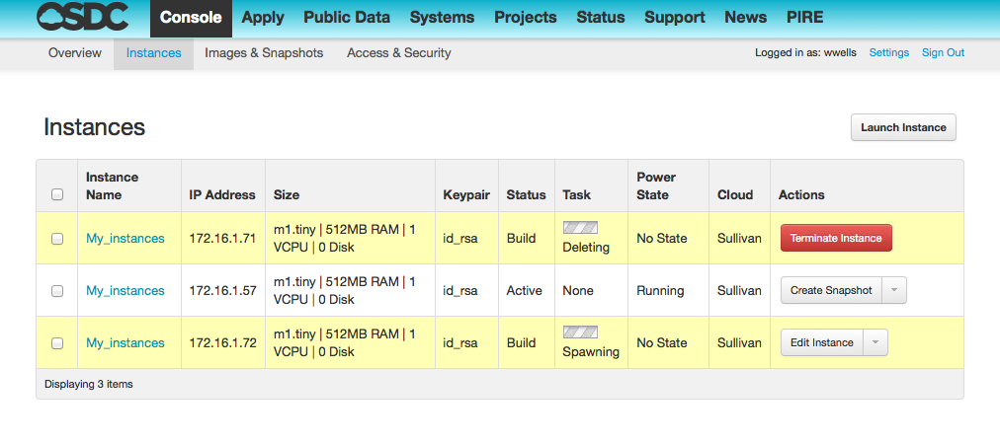

Virtual Machines (VMs)
===========================================

What is a VM?
-----------------

A virtual machine (VM) is a software-based emulation of a computer. 
Virtual machines operate based on the computer architecture and functions 
of a real or hypothetical computer.

Instances are another term for “virtual machine”.

.. _flavors:

OSDC VM Flavors
-----------------

There are a number of "flavors" you can use when spinning up a VM.  Below is a list
of the specifications for each available OSDC instance.   VCPU indicates the number of cores
activated when that flavor is used.   

Some jobs may require larger instances, some may require a small instance, 
others may require multiple smaller instances.  Your resource allocation :ref:`quota  <metering>` 
will determine the size and quantity of instance you can spin up.   

  =============  ========  ===============  ============
  Flavor         VCPUs     VM Disk (GB)     RAM (GB)           
  =============  ========  ===============  ============
  m1.tiny        1         0                .5          
  m1.small       1         20               2          
  m1.medium      2         20               4         
  m1.large       4         20               8          
  m1.xlarge      8         20               16          
  m2.xlarge      8         20               32          
  m1.xxlarge     16        20               32          
  m2.xxlarge     16        20               64          
  =============  ========  ===============  ============

.. NOTE::  When you launch an instance in the Tukey Console, you'll see in the lower left
	of the launch screen how much of your quota is in use.  Any Instances you might 
	attempt to launch beyond your given quota will fail to launch.

What is an Image?
-----------------

A virtual machine image is a single file which contains a virtual disk that 
has a bootable operating system installed on it.  Virtual machine images come in 
different formats. 

The OSDC Sullivan cloud currently has the following images:

*	CentOS-5.10-v1.0
*	CentOS-6.0-v1.0
*	Ubuntu-12.04-LTS-v1.3

.. _snapshot:

What is a Snapshot?
--------------------

A snapshot preserves the state and data of a virtual machine at a given point in time.

*	State refers to the virtual machine’s power state (for example, powered‐on, powered‐off, suspended).
*	Data includes all the files that make‐up the virtual machine, including disks, memory, and other devices.

On the OSDC you can publicly share your own snapshots or use already existing snapshots.   This process will help users and 
labs from duplicating work.   While currently in BETA, we're working on making changes to the metadata associated
with snapshots so that users can provide descriptions of the software packages, general purpose of the 
snapshot, and other helpful information. 

As a general rule of thumb, anything installed using ``apt-get`` will be saved during a snapshot.  Almost 
anything on the filesystem that's not in ``/tmp`` or ``/glusterfs`` will be saved. A helpful 
way to confirm that files in an image will snapshot correctly is is to run ``stat -c "%m" FILENAME``.   
If the output is "/" then your files will snapshot correctly.

..  warning::  Snapshots are not backups. The snapshot file is only a change log 
	of the original virtual disk, do not rely upon it as a direct backup process.

What is a Cluster?
------------------

.. _launch:

Launching an Instance in Tukey (General)
----------------------------------------

Below is a video on how to launch an instance from the Tukey console. For specifics
on how to launch an instance from your cloud, refer to the Resource Guide section of the support
documents for your particular resource.

VIDEO: Launching an Instance
^^^^^^^^^^^^^^^^^^^^^^^^^^^^^^^^^^^^^^^
.. raw:: html

        
<object width="480" height="385"><param name="movie"
        value="https://www.youtube.com/v/2aPMOhCgIHw&hl=en_US&fs=1&rel=0"></param><param
        name="allowFullScreen" value="true"></param><param
        name="allowscriptaccess" value="always"></param><embed
        src="https://www.youtube.com/v/2aPMOhCgIHw&hl=en_US&fs=1&rel=0"
        type="application/x-shockwave-flash" allowscriptaccess="always"
        allowfullscreen="true" width="480"
        height="385"></embed></object>

.. _inst_status:

Reviewing Instance Status
----------------------------

Instance Status can be easily reviewed from both the :ref:`command line  <commandline>` and the console.  

    3 instance statuses - Terminating, Built, and Spawning
