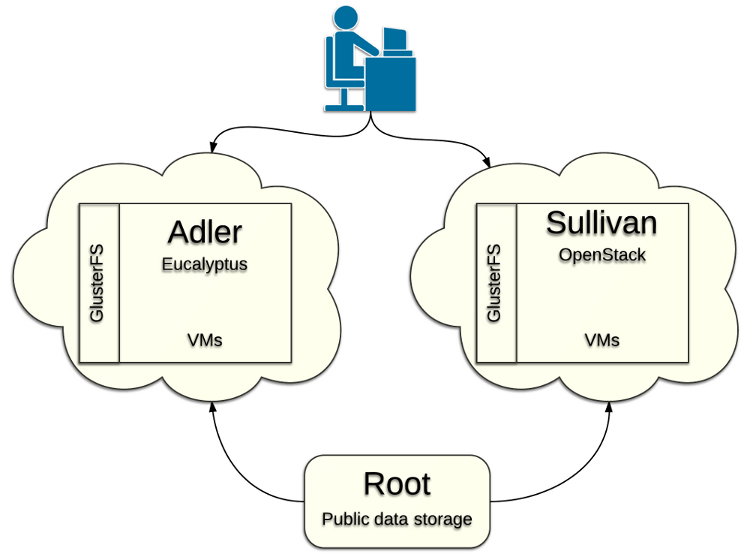

Introduction to the OSDC
===========================================

The `Open Science Data Cloud <https://opensciencedatacloud.org>`_
(OSDC) is a distributed, cloud-based infrastructure for managing,
analyzing, archiving and sharing scientific datasets. 

The OSDC operates two major public compute clouds named Adler and Sullivan and one storage cloud named Root. Adler is a `Eucalyptus <http://www.eucalyptus.com/>`_ based cloud and is also the host of Bionimbus Community Cloud. Sullivan is a newer `OpenStack <http://www.openstack.org/>`_ based cloud and the default cloud for new users. Root hosts about 1 PB of `public datasets <http://www.opensciencedatacloud.org/publicdata>`_ and is accessible from all of the OSDC clouds.

The OSDC also operates several protected clouds to provide platforms for users to compute over large protected human genomic datasets. These include the `Bionimbus Protected Data Cloud <https://bionimbus-pdc.opensciencedatacloud.org>`_ and the `Bionimbus Conte Cloud <http://www.contechicago.org/conte-cores/core-b>`_.

Each cloud has a distributed `Gluster File System <http://www.gluster.org/>`_ where users can store their data and access from all of their VMs.

The OSDC manages two Hadoop clusters, OCC-Y and LVOC, for select projects. The current documentation here does not cover the Hadoop clusters. If you are interested in these please contact us at info@opencloudconsortium.org.

   Overview of OSDC Public Infrastructure